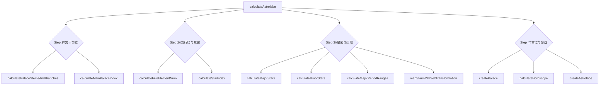

# 核心算法与命盘构建流程

本指南详细说明 `@ziweijs/core` 中的天干地支坐标体系、关键算法函数以及 `calculateAstrolabe` 的整体流水线，帮助贡献者在阅读 `packages/core/src/core/algorithms.ts` 与 `engine.ts` 时快速建立全局认知。

## 地支索引与坐标体系

| 维度                | 取值范围                               | 索引说明 |
| ------------------- | -------------------------------------- | -------- |
| 地支 / 宫位 (`_branchKeys`, `_palaceKeys`) | 12 个元素，起点为寅宫               | `0` 表示寅（命宫默认起点），顺序按十二地支依次增加 |
| 月份 (`monthIndex`) | `0 - 11`（农历正月至腊月）             | 用于定位命宫起点 |
| 时辰 (`hourIndex`)  | `0 - 11`（子时至亥时）                 | 与月份配合反推命宫 |
| 天干 (`_stemKeys`)  | 10 个元素（甲乙丙丁…癸）               | 结合地支推导五行局、宫干以及化曜 |

所有宫位相关算法都会围绕“索引 + 取模”的方式进行，基础工具函数 `packages/core/src/tools/math.ts` 中的 `$index`、`$relativeIndex`、`$oppositeIndex` 负责安全地循环取值。

## 命盘计算流水线

主流程封装在 `calculateAstrolabe()` 中，可拆解为四个阶段：

```text
┌──────────────┐     ┌────────────────────┐     ┌────────────────────┐     ┌────────────────────┐
│ Step 1       │     │ Step 2             │     │ Step 3             │     │ Step 4             │
│ 决定宫干命支 ├──▶──┤ 计算五行局与紫微天府 ├──▶──┤ 分派主/辅星 + 大限 │──▶──┤ 组装十二宫与运限 │
└──────────────┘     └────────────────────┘     └────────────────────┘     └────────────────────┘
```

### 1. 宫干命支 (engine.ts)

1. `calculatePalaceStemsAndBranches(stemKey)`：根据出生年干（五虎遁月诀）确定“十二宫 × 天干/地支”表。
2. `calculateMainPalaceIndex(monthIndex, hourIndex)`：寅宫为原点，按“顺月逆时”推算命宫落点。
3. `calculateCurrentPalaceIndex(mainPalaceIndex, index)`：将绝对宫位转换为“命宫视角”的相对索引，供后续推导宫职名称与顺序。

> 输出：每个宫位的基础干支信息，以及命宫索引（决定命宫名称和五行局）。

### 2. 五行局与紫微/天府坐标 (algorithms.ts)

1. `calculateFiveElementNum(stemKey, branchKey)`：以命宫干支推得五行局（名称、局数值、行数索引）。
2. `calculateStarIndex(day, fiveElementNumValue)`：利用日数与五行局，计算紫微、天府两大星系的落宫（`ziweiIndex`、`tianfuIndex`）。

> 输出：五行局名称/数值以及紫微系的核心定位，为主星分布打底。

### 3. 星曜与大限分布

- **主星**：`calculateMajorStars({ ziweiIndex, tianfuIndex, birthYearStemKey })`
  - 通过 `createMetaMajorStars` 构建十四主星基准位与飞泊方向；
  - 结合 `calculateStarTransformation` 为星曜加上禄/权/科/忌化曜。
- **辅星**：`calculateMinorStars({ monthIndex, hourIndex, birthYearStemKey })`
  - 内部通过 `getMinorStarIndices` 配置左右昌曲等星曜在十二宫的相对位置。
- **大限**：
  - `calculateMajorPeriodRanges(mainPalaceIndex, horoscopeDirection, fiveElementNumValue)` 决定每宫负责的 10 年区间；
  - `calculateHoroscopePalaces` / `calculateHoroscope` 将流年信息映射回宫位。
- **自化**：`mapStarsWithSelfTransformation` 根据宫干及对宫宫干批量添加自化 (Self-Transformation) 标记。

> 输出：`majorStars[index]`、`minorStars[index]`、`horoscopeRanges[index]` 三个数组，描述每宫的星耀与大限。

### 4. 宫位组装与命盘成型

`engine.ts` 使用 `createPalace` + `createAstrolabe` 将所有数据整合：

1. 以 `palaceStemsAndBranches.map` 为骨架，每个宫位注入：
   - 宫干/宫支（含来因宫判定 `isLaiYin`）；
   - 主星/辅星（附带自化、化曜信息）；
   - 对应大限区间 (`horoscopeRanges[index]`)。
2. `calculateHoroscope` 根据出生年支与当前年份，定位当前运限并生成“十年 × 岁数 × 对应宫位”的列表。
3. `createAstrolabe` 汇总个人信息（性别、生肖、阴历/阳历）、命宫信息、星曜布置与运限，返回最终的命盘对象。

## 关键函数关系图



> *mermaid 图在大多数 Markdown 预览器（VSCode、GitHub）中都可渲染；在不支持的环境下可参考上一节的文字流程。*

## 开发与调试建议

1. **观察单一环节**：可以在测试中直接调用 `calculateMajorStars` 等函数，对照产出的星曜列表，验证特定干支组合是否符合传统规则。
2. **断点调试**：`calculateAstrolabe` 输出对象包含 `_version`、`horoscopeDirection` 等辅助字段，可用于排查不同性别/阴阳年干导致的顺逆问题。
3. **扩展语言或资源**：若仅需修改描述（如宫名、化曜名称），只需在 `packages/core/src/locales/` 中维护对应条目，算法本身无需调整。
4. **测试入口**：`packages/core/src/core/__tests__` 提供了主流程的断言示例，可作为撰写新用例的模板。

通过以上文档与示意图，贡献者可以更精准地定位算法职责，在扩展或调试紫微斗数相关功能时避免盲区。如在具体环节（例如大限推演、化曜规则等）需要更深入的解释，欢迎在 issue 或 PR 中继续讨论。***
